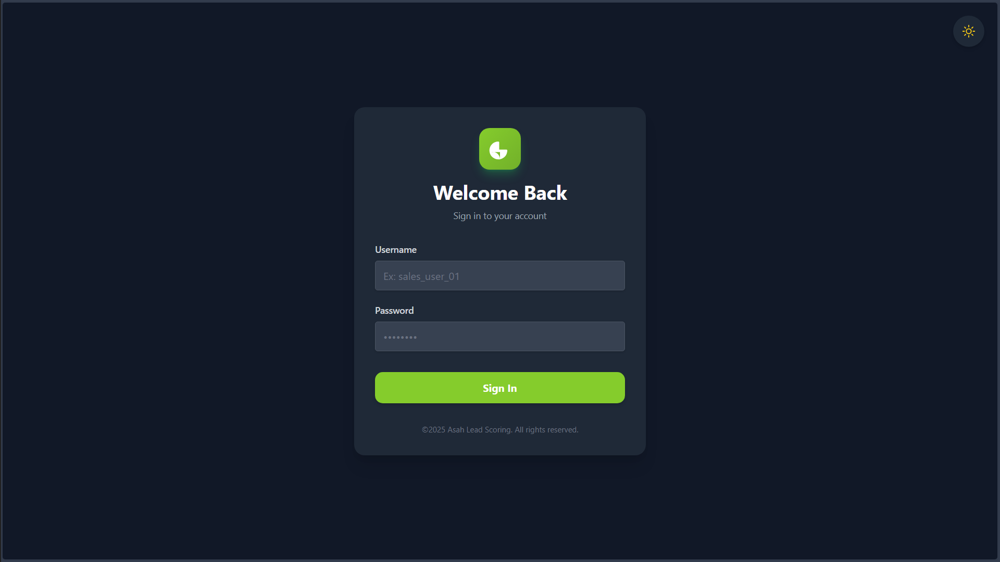
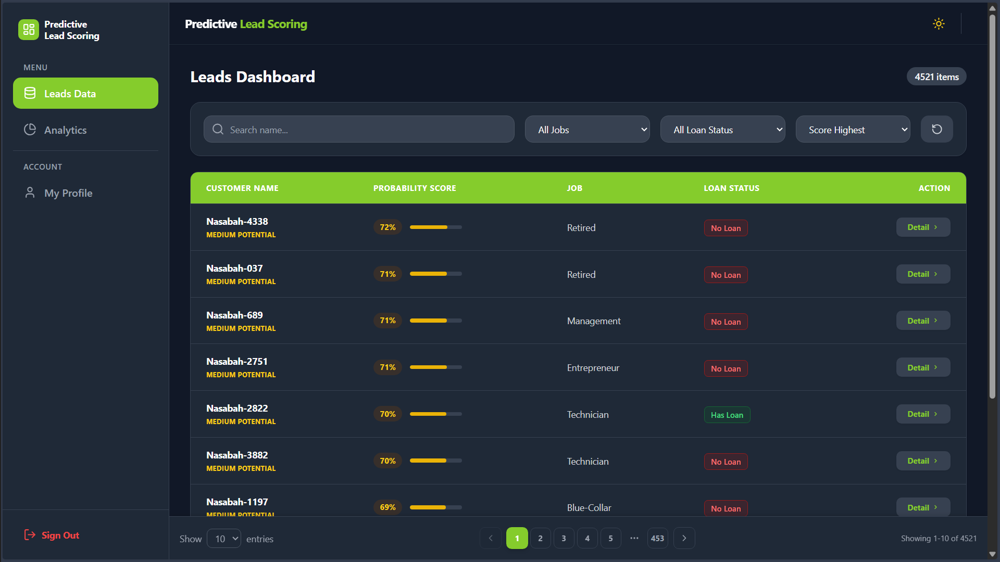
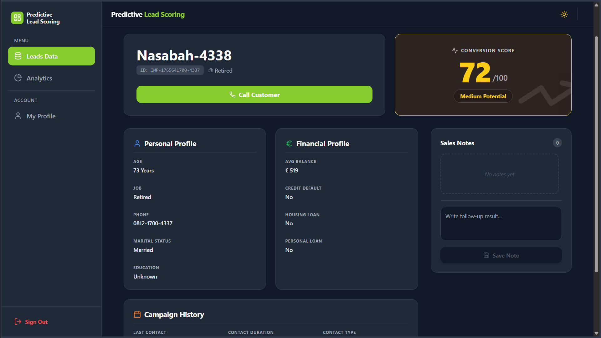
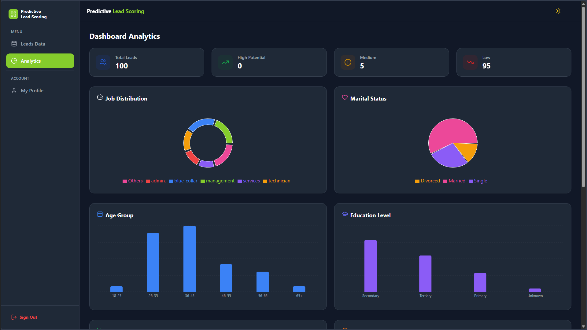
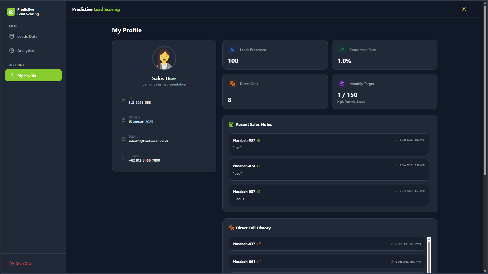

# SalesPilot

SalesPilot adalah aplikasi lead scoring end-to-end untuk memprioritaskan prospek dengan potensi konversi tertinggi, dikembangkan sebagai Capstone Project Dicoding (Case AC-03) dalam program [Asah led by Dicoding in association with Accenture](https://www.dicoding.com/asah) oleh Tim A25-CS065.

---

## Tim Pengembang
| Nama                     | ID Cohort      | Learning Path              |
|--------------------------|----------------|----------------------------|
| Akbar Rezy Hanara S      | R284D5Y0128    | React & Backend with AI    |
| Ahmad Misbach            | R284D5Y0099    | React & Backend with AI    |
| Bram Prastyo Nugroho     | R284D5Y0364    | React & Backend with AI    |
| Augie Bryan Athalla      | M296D5Y0308    | Machine Learning           |
| Fayzul Haq               | M284D5Y0624    | Machine Learning           |

## Overview
SalesPilot membantu tim sales memaksimalkan efektivitas kampanye dengan:
- Prediksi probabilitas konversi prospek menggunakan model XGBoost
- Dashboard analitik distribusi leads (job, usia, education, marital)
- Detail lead: profil demografis/finansial, riwayat kampanye, catatan sales, call log
- Monitoring KPI user, conversion rate, aktivitas call

## Arsitektur
- **Frontend:** React (Vite), TailwindCSS, React Router, Recharts (deploy: Vercel)
- **Backend:** FastAPI (Python 3.13), SQLAlchemy, Pydantic (deploy: Railway)
- **ML:** XGBoost, scikit-learn, pandas, numpy (serving via FastAPI)
- **Database:** PostgreSQL (Neon/Railway)

## Cara Setup & Replikasi
1. **Clone repository**
	```bash
	git clone https://github.com/arezyhs/asah-capstone-lead-scoring.git
	cd asah-capstone-lead-scoring
	```
2. **Setup Backend**
	```bash
	pip install -r backend/requirements.txt
	uvicorn app.main:app --host 0.0.0.0 --port 8000
	```
3. **Setup Frontend**
	```bash
	cd frontend
	npm install
	npm run dev
	```
4. **Setup ML Service** (opsional, jika ingin inference terpisah)
	```bash
	cd ml
	pip install -r requirements.txt
	uvicorn app:app --host 0.0.0.0 --port 8001
	```
5. **Konfigurasi Environment**
	- Atur `DATABASE_URL` (Neon/Railway) di `.env` backend
	- Endpoint API frontend diatur di `src/api/apiClient.js`

## Deployment
- **Frontend:** Vercel
- **Backend:** Railway (lihat deployment/railway.json)
- **Database:** Neon (PostgreSQL)
- **Docker:** Tersedia Dockerfile untuk backend

## Application Screenshots
Berikut adalah tampilan utama dari aplikasi **SalesPilot** yang menunjukkan alur penggunaan dan fitur inti sistem.








## Endpoint Utama
- `GET /health` — status API
- `POST /api/auth/login` — login dummy
- `GET /leads` — list lead
- `GET /leads/{id}` — detail lead
- `POST /notes` — tambah catatan
- `POST /predict` — prediksi konversi (ML)

## Lisensi
Capstone Project Dicoding A25-CS065.
---

**Dikembangkan oleh Tim A25-CS065 - Dicoding Asah Capstone Bootcamp**
