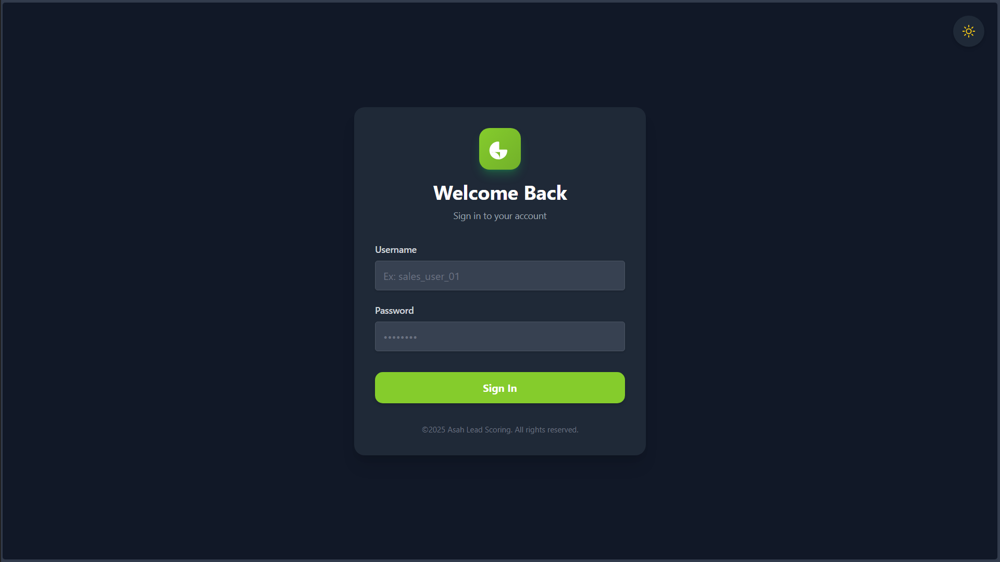
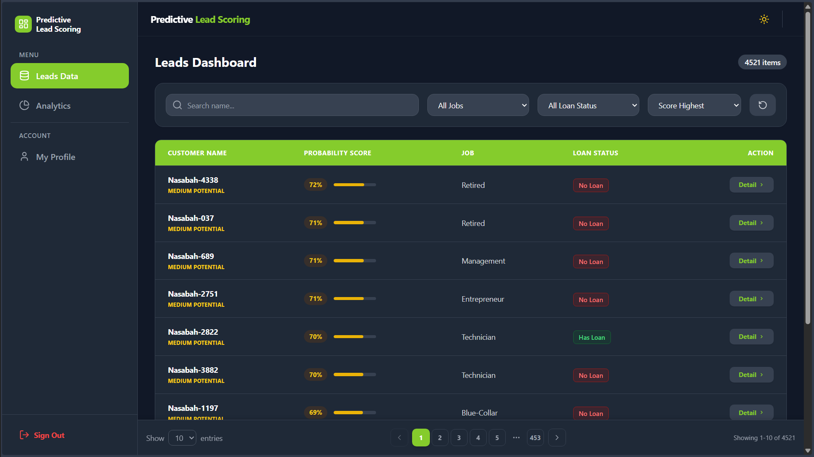
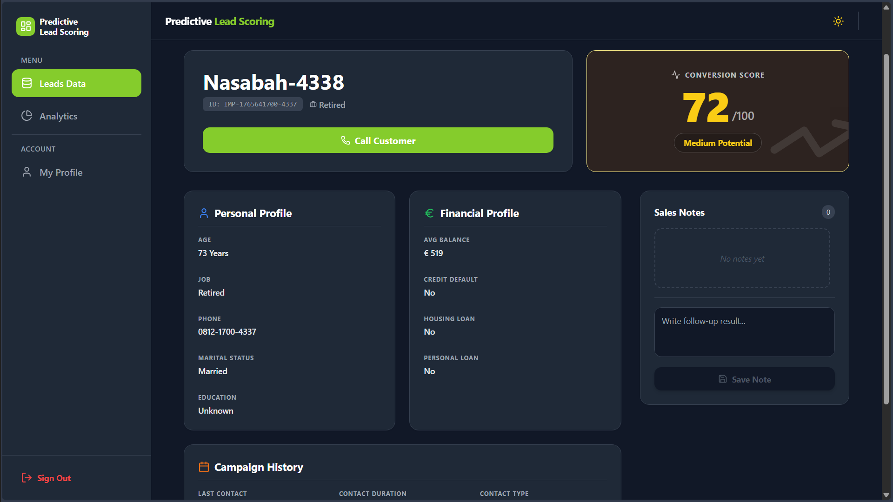
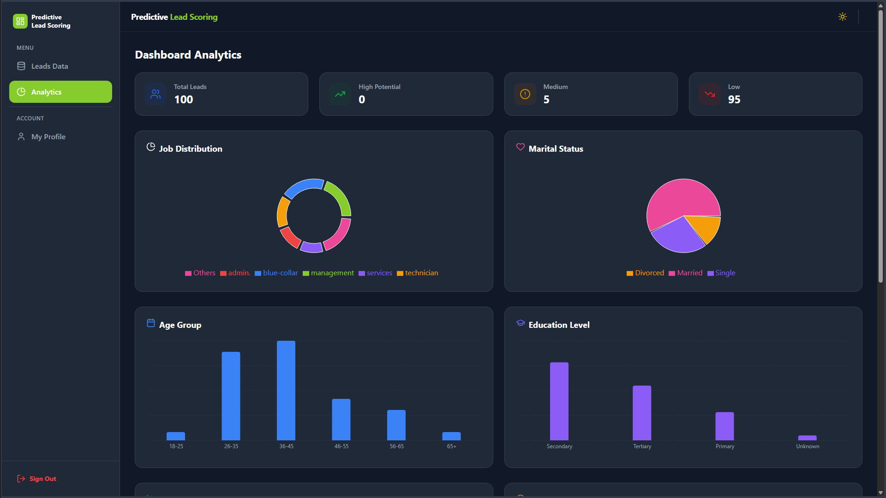
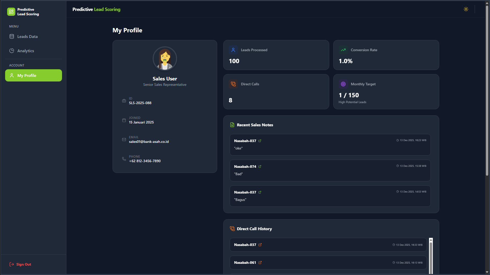

<div align="center">

# SalesPilot - Aplikasi Lead Scoring Berbasis AI


</div>

SalesPilot adalah aplikasi *lead scoring end-to-end* untuk memprioritaskan prospek dengan potensi konversi tertinggi, dikembangkan sebagai *Capstone Project* (Case AC-03) dalam program **[Asah led by Dicoding in association with Accenture](https://www.dicoding.com/asah)** oleh Tim A25-CS065.

Berbeda dengan CRM tradisional, SalesPilot mengintegrasikan pemodelan *Machine Learning* (XGBoost) untuk memprediksi probabilitas konversi setiap *lead*. Hal ini membantu memaksimalkan efektivitas kampanye, memantau metrik performa, dan mencatat riwayat interaksi secara langsung dalam satu platform yang terpusat.

---

## 📸 Tangkapan Layar Aplikasi

Berikut adalah tampilan utama dari aplikasi **SalesPilot** yang menunjukkan alur penggunaan dan fitur inti sistem.

<div align="center">
  
  
  
  
  
</div>

---

## ✨ Fitur Utama

### 📊 Dashboard & Analitik
- **Monitoring KPI**: Memantau *conversion rate*, aktivitas panggilan, dan performa pengguna secara langsung.
- **Distribusi Leads**: Analitik mendalam mengenai distribusi prospek berdasarkan pekerjaan, usia, tingkat edukasi, dan status pernikahan (*marital status*).

### 🎯 Manajemen Lead & Prioritas
- **Prediksi Konversi Berbasis AI**: Menampilkan probabilitas konversi untuk setiap *lead* menggunakan model *Machine Learning* (XGBoost), sehingga tim sales dapat fokus pada *lead* dengan skor tinggi.
- **Profil Detail**: Menampilkan informasi lengkap *lead*, mulai dari profil demografis, kondisi finansial, hingga riwayat kampanye.

### 📝 Aktivitas & Kolaborasi
- **Riwayat Interaksi**: Fitur pencatatan catatan tim sales (*sales notes*) dan *call log* untuk melacak setiap tahapan komunikasi dengan prospek.

---

## ⚙️ Arsitektur & Teknologi

Aplikasi ini menggunakan pendekatan arsitektur terpisah (*decoupled architecture*):

- **Frontend:** React (Vite), TailwindCSS, React Router, Recharts *(di-deploy ke Vercel)*
- **Backend:** FastAPI (Python 3.13), SQLAlchemy, Pydantic *(di-deploy ke Railway)*
- **Machine Learning:** XGBoost, scikit-learn, pandas, numpy *(serving via FastAPI)*
- **Database:** PostgreSQL *(Neon/Railway)*

---

## 💻 Cara Setup & Replikasi

### 1. Clone Repository
```bash
git clone https://github.com/arezyhs/asah-capstone-lead-scoring.git
cd asah-capstone-lead-scoring
```

### 2. Setup Backend
```bash
pip install -r backend/requirements.txt
uvicorn app.main:app --host 0.0.0.0 --port 8000
```

### 3. Setup Frontend
Buka terminal baru:
```bash
cd frontend
npm install
npm run dev
```

### 4. Setup ML Service (Opsional)
Jika ingin melakukan *inference* terpisah:
```bash
cd ml
pip install -r requirements.txt
uvicorn app:app --host 0.0.0.0 --port 8001
```

### 5. Konfigurasi Environment
- Atur `DATABASE_URL` (Neon/Railway) di file `.env` direktori backend.
- Endpoint API frontend diatur di `src/api/apiClient.js`.

---

## 🌐 Endpoint Utama

- `GET /health` — Status API
- `POST /api/auth/login` — Login dummy
- `GET /leads` — Daftar list *lead*
- `GET /leads/{id}` — Detail *lead*
- `POST /notes` — Tambah catatan
- `POST /predict` — Prediksi konversi (ML)

---

## 👥 Tim Pengembang (A25-CS065)

| Nama                     | ID Cohort      | Learning Path              |
|--------------------------|----------------|----------------------------|
| **Akbar Rezy Hanara S**  | R284D5Y0128    | React & Backend with AI    |
| **Ahmad Misbach**        | R284D5Y0099    | React & Backend with AI    |
| **Bram Prastyo Nugroho** | R284D5Y0364    | React & Backend with AI    |
| **Augie Bryan Athalla**  | M296D5Y0308    | Machine Learning           |
| **Fayzul Haq**           | M284D5Y0624    | Machine Learning           |

<div align="center">
  <br/>
  <b>Dikembangkan oleh Tim A25-CS065 - Dicoding Asah Capstone</b>
</div>
